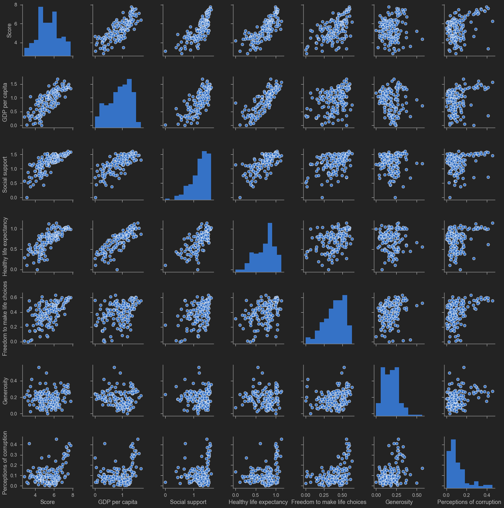
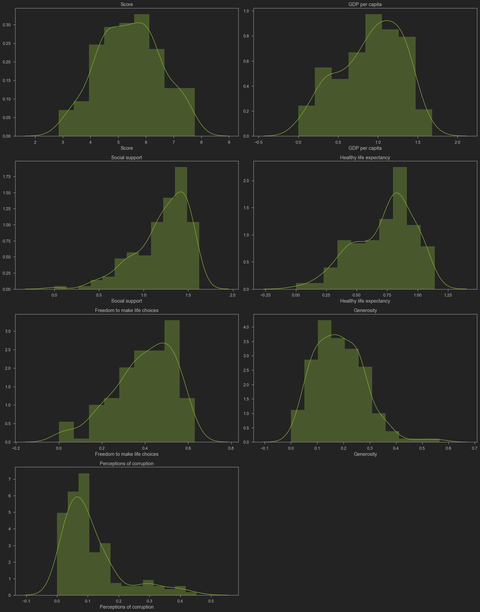
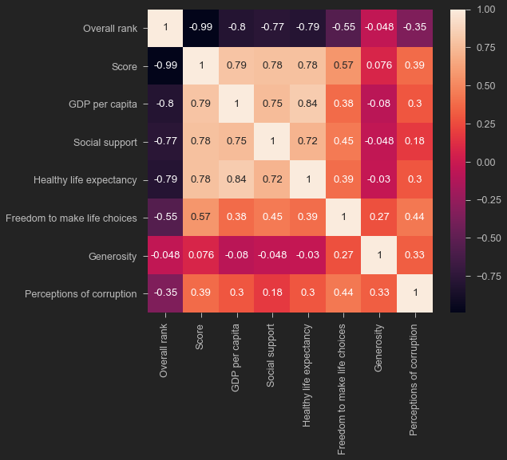

# TASK #1: IMPORT DATASETS AND LIBRARIES


```python
# The World Happiness Report determines the state of global happiness. 
# The happiness scores and rankings data has been collected by asking individuals to rank their life.
# Ranking ranges from 0 (worst possible life) to 10 (best possible life). 

import pandas as pd
import numpy as np
import seaborn as sns
import matplotlib.pyplot as plt
import plotly.express as px
import warnings
warnings.filterwarnings("ignore")

from jupyterthemes import jtplot
jtplot.style(theme = 'monokai', context = 'notebook', ticks = True, grid = False)
```


```python
# Import csv file into pandas dataframe
happy_df = pd.read_csv('happiness_report.csv')
```


```python

```


```python
# print the first 5 rows of the dataframe
happy_df.head()
```


<div>
<style scoped>
    .dataframe tbody tr th:only-of-type {
        vertical-align: middle;
    }

    .dataframe tbody tr th {
        vertical-align: top;
    }

    .dataframe thead th {
        text-align: right;
    }
</style>
<table border="1" class="dataframe">
  <thead>
    <tr style="text-align: right;">
      <th></th>
      <th>Overall rank</th>
      <th>Country or region</th>
      <th>Score</th>
      <th>GDP per capita</th>
      <th>Social support</th>
      <th>Healthy life expectancy</th>
      <th>Freedom to make life choices</th>
      <th>Generosity</th>
      <th>Perceptions of corruption</th>
    </tr>
  </thead>
  <tbody>
    <tr>
      <th>0</th>
      <td>1</td>
      <td>Finland</td>
      <td>7.769</td>
      <td>1.340</td>
      <td>1.587</td>
      <td>0.986</td>
      <td>0.596</td>
      <td>0.153</td>
      <td>0.393</td>
    </tr>
    <tr>
      <th>1</th>
      <td>2</td>
      <td>Denmark</td>
      <td>7.600</td>
      <td>1.383</td>
      <td>1.573</td>
      <td>0.996</td>
      <td>0.592</td>
      <td>0.252</td>
      <td>0.410</td>
    </tr>
    <tr>
      <th>2</th>
      <td>3</td>
      <td>Norway</td>
      <td>7.554</td>
      <td>1.488</td>
      <td>1.582</td>
      <td>1.028</td>
      <td>0.603</td>
      <td>0.271</td>
      <td>0.341</td>
    </tr>
    <tr>
      <th>3</th>
      <td>4</td>
      <td>Iceland</td>
      <td>7.494</td>
      <td>1.380</td>
      <td>1.624</td>
      <td>1.026</td>
      <td>0.591</td>
      <td>0.354</td>
      <td>0.118</td>
    </tr>
    <tr>
      <th>4</th>
      <td>5</td>
      <td>Netherlands</td>
      <td>7.488</td>
      <td>1.396</td>
      <td>1.522</td>
      <td>0.999</td>
      <td>0.557</td>
      <td>0.322</td>
      <td>0.298</td>
    </tr>
  </tbody>
</table>
</div>


```python
happy_df.tail()
```


<div>
<style scoped>
    .dataframe tbody tr th:only-of-type {
        vertical-align: middle;
    }

    .dataframe tbody tr th {
        vertical-align: top;
    }

    .dataframe thead th {
        text-align: right;
    }
</style>
<table border="1" class="dataframe">
  <thead>
    <tr style="text-align: right;">
      <th></th>
      <th>Overall rank</th>
      <th>Country or region</th>
      <th>Score</th>
      <th>GDP per capita</th>
      <th>Social support</th>
      <th>Healthy life expectancy</th>
      <th>Freedom to make life choices</th>
      <th>Generosity</th>
      <th>Perceptions of corruption</th>
    </tr>
  </thead>
  <tbody>
    <tr>
      <th>151</th>
      <td>152</td>
      <td>Rwanda</td>
      <td>3.334</td>
      <td>0.359</td>
      <td>0.711</td>
      <td>0.614</td>
      <td>0.555</td>
      <td>0.217</td>
      <td>0.411</td>
    </tr>
    <tr>
      <th>152</th>
      <td>153</td>
      <td>Tanzania</td>
      <td>3.231</td>
      <td>0.476</td>
      <td>0.885</td>
      <td>0.499</td>
      <td>0.417</td>
      <td>0.276</td>
      <td>0.147</td>
    </tr>
    <tr>
      <th>153</th>
      <td>154</td>
      <td>Afghanistan</td>
      <td>3.203</td>
      <td>0.350</td>
      <td>0.517</td>
      <td>0.361</td>
      <td>0.000</td>
      <td>0.158</td>
      <td>0.025</td>
    </tr>
    <tr>
      <th>154</th>
      <td>155</td>
      <td>Central African Republic</td>
      <td>3.083</td>
      <td>0.026</td>
      <td>0.000</td>
      <td>0.105</td>
      <td>0.225</td>
      <td>0.235</td>
      <td>0.035</td>
    </tr>
    <tr>
      <th>155</th>
      <td>156</td>
      <td>South Sudan</td>
      <td>2.853</td>
      <td>0.306</td>
      <td>0.575</td>
      <td>0.295</td>
      <td>0.010</td>
      <td>0.202</td>
      <td>0.091</td>
    </tr>
  </tbody>
</table>
</div>


**PRACTICE OPPORTUNITY #1 [OPTIONAL]:** 
- **Select 2 countries from the dataframe and explore scores. Perform sanity check.**


```python

```


```python
happy_df[happy_df['Country or region'] == 'Canada']
```


<div>
<style scoped>
    .dataframe tbody tr th:only-of-type {
        vertical-align: middle;
    }

    .dataframe tbody tr th {
        vertical-align: top;
    }

    .dataframe thead th {
        text-align: right;
    }
</style>
<table border="1" class="dataframe">
  <thead>
    <tr style="text-align: right;">
      <th></th>
      <th>Overall rank</th>
      <th>Country or region</th>
      <th>Score</th>
      <th>GDP per capita</th>
      <th>Social support</th>
      <th>Healthy life expectancy</th>
      <th>Freedom to make life choices</th>
      <th>Generosity</th>
      <th>Perceptions of corruption</th>
    </tr>
  </thead>
  <tbody>
    <tr>
      <th>8</th>
      <td>9</td>
      <td>Canada</td>
      <td>7.278</td>
      <td>1.365</td>
      <td>1.505</td>
      <td>1.039</td>
      <td>0.584</td>
      <td>0.285</td>
      <td>0.308</td>
    </tr>
  </tbody>
</table>
</div>


```python
happy_df[happy_df['Country or region'] == 'Norway']
```


<div>
<style scoped>
    .dataframe tbody tr th:only-of-type {
        vertical-align: middle;
    }

    .dataframe tbody tr th {
        vertical-align: top;
    }

    .dataframe thead th {
        text-align: right;
    }
</style>
<table border="1" class="dataframe">
  <thead>
    <tr style="text-align: right;">
      <th></th>
      <th>Overall rank</th>
      <th>Country or region</th>
      <th>Score</th>
      <th>GDP per capita</th>
      <th>Social support</th>
      <th>Healthy life expectancy</th>
      <th>Freedom to make life choices</th>
      <th>Generosity</th>
      <th>Perceptions of corruption</th>
    </tr>
  </thead>
  <tbody>
    <tr>
      <th>2</th>
      <td>3</td>
      <td>Norway</td>
      <td>7.554</td>
      <td>1.488</td>
      <td>1.582</td>
      <td>1.028</td>
      <td>0.603</td>
      <td>0.271</td>
      <td>0.341</td>
    </tr>
  </tbody>
</table>
</div>


# TASK #2: PERFORM EXPLORATORY DATA 


```python
# Check the number of non-null values in the dataframe
happy_df.info()
```

    <class 'pandas.core.frame.DataFrame'>
    RangeIndex: 156 entries, 0 to 155
    Data columns (total 9 columns):
     #   Column                        Non-Null Count  Dtype  
    ---  ------                        --------------  -----  
     0   Overall rank                  156 non-null    int64  
     1   Country or region             156 non-null    object 
     2   Score                         156 non-null    float64
     3   GDP per capita                156 non-null    float64
     4   Social support                156 non-null    float64
     5   Healthy life expectancy       156 non-null    float64
     6   Freedom to make life choices  156 non-null    float64
     7   Generosity                    156 non-null    float64
     8   Perceptions of corruption     156 non-null    float64
    dtypes: float64(7), int64(1), object(1)
    memory usage: 11.1+ KB
    


```python
# Check Null values
happy_df.isnull().sum()
```


    Overall rank                    0
    Country or region               0
    Score                           0
    GDP per capita                  0
    Social support                  0
    Healthy life expectancy         0
    Freedom to make life choices    0
    Generosity                      0
    Perceptions of corruption       0
    dtype: int64


```python
# Obtain the Statistical summary of the dataframe
happy_df.describe()
```


<div>
<style scoped>
    .dataframe tbody tr th:only-of-type {
        vertical-align: middle;
    }

    .dataframe tbody tr th {
        vertical-align: top;
    }

    .dataframe thead th {
        text-align: right;
    }
</style>
<table border="1" class="dataframe">
  <thead>
    <tr style="text-align: right;">
      <th></th>
      <th>Overall rank</th>
      <th>Score</th>
      <th>GDP per capita</th>
      <th>Social support</th>
      <th>Healthy life expectancy</th>
      <th>Freedom to make life choices</th>
      <th>Generosity</th>
      <th>Perceptions of corruption</th>
    </tr>
  </thead>
  <tbody>
    <tr>
      <th>count</th>
      <td>156.000000</td>
      <td>156.000000</td>
      <td>156.000000</td>
      <td>156.000000</td>
      <td>156.000000</td>
      <td>156.000000</td>
      <td>156.000000</td>
      <td>156.000000</td>
    </tr>
    <tr>
      <th>mean</th>
      <td>78.500000</td>
      <td>5.407096</td>
      <td>0.905147</td>
      <td>1.208814</td>
      <td>0.725244</td>
      <td>0.392571</td>
      <td>0.184846</td>
      <td>0.110603</td>
    </tr>
    <tr>
      <th>std</th>
      <td>45.177428</td>
      <td>1.113120</td>
      <td>0.398389</td>
      <td>0.299191</td>
      <td>0.242124</td>
      <td>0.143289</td>
      <td>0.095254</td>
      <td>0.094538</td>
    </tr>
    <tr>
      <th>min</th>
      <td>1.000000</td>
      <td>2.853000</td>
      <td>0.000000</td>
      <td>0.000000</td>
      <td>0.000000</td>
      <td>0.000000</td>
      <td>0.000000</td>
      <td>0.000000</td>
    </tr>
    <tr>
      <th>25%</th>
      <td>39.750000</td>
      <td>4.544500</td>
      <td>0.602750</td>
      <td>1.055750</td>
      <td>0.547750</td>
      <td>0.308000</td>
      <td>0.108750</td>
      <td>0.047000</td>
    </tr>
    <tr>
      <th>50%</th>
      <td>78.500000</td>
      <td>5.379500</td>
      <td>0.960000</td>
      <td>1.271500</td>
      <td>0.789000</td>
      <td>0.417000</td>
      <td>0.177500</td>
      <td>0.085500</td>
    </tr>
    <tr>
      <th>75%</th>
      <td>117.250000</td>
      <td>6.184500</td>
      <td>1.232500</td>
      <td>1.452500</td>
      <td>0.881750</td>
      <td>0.507250</td>
      <td>0.248250</td>
      <td>0.141250</td>
    </tr>
    <tr>
      <th>max</th>
      <td>156.000000</td>
      <td>7.769000</td>
      <td>1.684000</td>
      <td>1.624000</td>
      <td>1.141000</td>
      <td>0.631000</td>
      <td>0.566000</td>
      <td>0.453000</td>
    </tr>
  </tbody>
</table>
</div>


```python
# check the number of duplicated entries in the dataframe
happy_df.duplicated().sum() # since there are no duplicates, no further action is required
```


    0


**PRACTICE OPPORTUNITY #2 [OPTIONAL]:** 
- **Which country has the maximum happiness score? What is the perception of corruption in this country?**


```python
happy_df['Score'].max()
```


    7.769


```python
happy_df[happy_df['Score'] == happy_df['Score'].max()]
```


<div>
<style scoped>
    .dataframe tbody tr th:only-of-type {
        vertical-align: middle;
    }

    .dataframe tbody tr th {
        vertical-align: top;
    }

    .dataframe thead th {
        text-align: right;
    }
</style>
<table border="1" class="dataframe">
  <thead>
    <tr style="text-align: right;">
      <th></th>
      <th>Overall rank</th>
      <th>Country or region</th>
      <th>Score</th>
      <th>GDP per capita</th>
      <th>Social support</th>
      <th>Healthy life expectancy</th>
      <th>Freedom to make life choices</th>
      <th>Generosity</th>
      <th>Perceptions of corruption</th>
    </tr>
  </thead>
  <tbody>
    <tr>
      <th>0</th>
      <td>1</td>
      <td>Finland</td>
      <td>7.769</td>
      <td>1.34</td>
      <td>1.587</td>
      <td>0.986</td>
      <td>0.596</td>
      <td>0.153</td>
      <td>0.393</td>
    </tr>
  </tbody>
</table>
</div>


# TASK #3: PERFORM DATA VISUALIZATION: PAIRPLOT & SCATTERMATRIX


```python
# you can use Seaborn to plot the pairplots as follows (Note that the plot is no longer interactive): 
fig = plt.figure(figsize = (20,20))
sns.pairplot(happy_df[['Score','GDP per capita', 'Social support', 'Healthy life expectancy', 
    'Freedom to make life choices', 'Generosity', 'Perceptions of corruption']])

# Positive correlation between GDP and score 
# Positive correlation between Social Support and score 

```


    <seaborn.axisgrid.PairGrid at 0x158f3409438>


    <Figure size 1440x1440 with 0 Axes>


    

    


# TASK #4: PERFORM DATA VISUALIZATION: DISTPLOT & CORRELATION MATRIX


```python
# distplot combines the matplotlib.hist function with seaborn kdeplot()

columns = ['Score','GDP per capita', 'Social support', 'Healthy life expectancy', 'Freedom to make life choices', 'Generosity',
       'Perceptions of corruption']

plt.figure(figsize = (20, 50))
for i in range(len(columns)):
  plt.subplot(8, 2, i+1)
  sns.distplot(happy_df[columns[i]], color = 'g');
  plt.title(columns[i])

plt.tight_layout()
```


    

    


```python
# Get the correlation matrix
corr_matrix = happy_df.corr()
corr_matrix
sns.heatmap(corr_matrix, annot = True)
```


    <matplotlib.axes._subplots.AxesSubplot at 0x158f889a0f0>


    

    


# TASK #5: PERFORM DATA VISUALIZATION: SCATTERPLOTS AND BUBBLE CHARTS


```python
# Plot the relationship between score and GDP (while adding color and size)
fig = px.scatter(happy_df, x = "GDP per capita", y = "Score", size = 'Overall rank', color = "Country or region", hover_name = "Country or region")

fig.update_layout(title_text = 'Happiness Score vs GDP per Capita')
fig.show()
```


```python
# Plot the relationship between score and freedom to make life choices

fig = px.scatter(happy_df, x = 'Freedom to make life choices', y = "Score", size = 'Overall rank', color = "Country or region", hover_name = "Country or region",
          trendline = "ols")

fig.update_layout(title_text = 'Happiness Score vs Freedom to make life choices')
fig.show()
```


                        })                };                });            </script>        </div>

